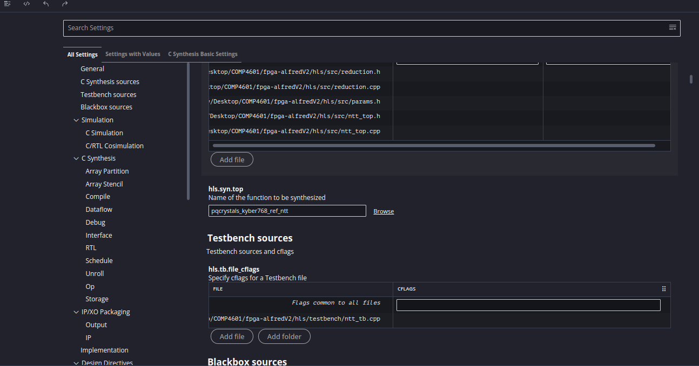

# Project Setup

## Cloing Repo and Compiling
1. Clone the repo.
2. Run only the preprocessor on `ntt_top.cpp`  
```sh
gcc -E . hls/src/ntt_top.cpp  
```
3. Identify top level function. It should be something like `pqcrystals_kyber768_ref_ntt`

## Creating New Vitis Project
1. Create a new vitis workspace and create a new "HLS" component:
    - Name it "ntt_core"
    - Add all the `hls/src/` and set the top to `pqcrystals_kyber768_ref_ntt`. Add testbench files (as of right now there is just the one simple invntt(ntt(work)) test)
    - In the "Hardware" tab, select "Platform" > "kv260_custom" or the Xilinx provided generic kv260 if you aren't deploying it yet
    - In the "Settings" tab, enter "200MHz" for clock target, select "vitis" for flow target
    - select "xo" for package.output.format
2. Change the top level component by going to the ```hls_config.cfg``` file, scroll down to the hls.syn.top **type** in the name of the top level function, which by default should be ```pqcrystals_kyber768_ref_ntt```.



3. Run simulaiton. Verify that it passes.
4. Run synthesis


# Notes on optimisation
1. Streamline memory operation
    - [x] local r array
2. Mental model of data dependancies and inter interation dependancies
3. optimise fqmul and reductions
4. 12 bit types instead of 16


find a good 256 point hardware fft for inspiration of how fine grained we can break down the main compute loop
we don't have to fft in place
At a certain point hls tasks let you pass data back up the call chain.
Sort of like threads

# Changelog

(21/7/26) Riley - Updated section on changing the top level function to be a bit clearer and added image.