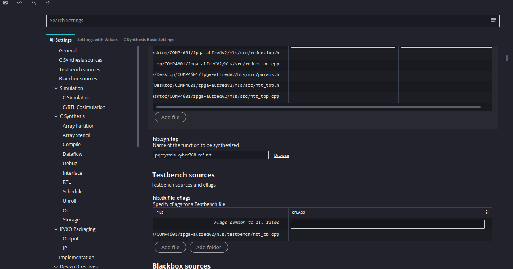

# Project Setup

## Cloing Repo and Compiling
1. Clone the repo.
2. Run only the preprocessor on `ntt_top.cpp`  
```sh
gcc -E . hls/src/ntt_top.cpp  
```
3. Identify top level function. It should be something like `pqcrystals_kyber768_ref_ntt`

## Creating New Vitis Project
1. Create a new vitis workspace and create a new "HLS" component:
    - Name it "ntt_core"
    - Add all the `hls/src/` and set the top to `pqcrystals_kyber768_ref_ntt`. Add testbench files (as of right now there is just the one simple invntt(ntt(work)) test)
    - In the "Hardware" tab, select "Platform" > "kv260_custom" or the Xilinx provided generic kv260 if you aren't deploying it yet
    - In the "Settings" tab, enter "200MHz" for clock target, select "vitis" for flow target
    - select "xo" for package.output.format
2. Change the top level component by going to the ```hls_config.cfg``` file, scroll down to the hls.syn.top **type** in the name of the top level function, which by default should be ```pqcrystals_kyber768_ref_ntt```.



3. Run simulaiton. Verify that it passes.
4. Run synthesis

# Software Benchmarking

`bench/` times the reference polynomial multiply so the kernel has something to
be compared against. It links the **unmodified** pq-crystals `ntt.c` + `reduce.c`
(built as C) not our HLS source and verifies its output against a textbook negacyclic product before timing anything.

Get the reference source once:

```sh
git clone https://github.com/pq-crystals/kyber
```

## x86 smoke test

Confirms the harness builds and is correct.

```sh
cd bench
make KYBER=/path/to/kyber/ref
mv bench_poly_mul bench_poly_mul_x86
./bench_poly_mul
```

## Cross-compile for the A53

Vitis ships a toolchain, so no need to install anything. `-static` should avoid any glibc mismatch with the board image.

```sh
export PATH=/tools/Xilinx/2025.2/Vitis/gnu/aarch64/lin/aarch64-linux/bin:$PATH

cd bench && make clean
make KYBER=/path/to/kyber/ref \
     CC=aarch64-linux-gnu-gcc CXX=aarch64-linux-gnu-g++ \
     LDFLAGS=-static
mv bench_poly_mul bench_poly_mul_aarch64

# optional: -mcpu tuned build
make clean
make KYBER=/path/to/kyber/ref \
     CC=aarch64-linux-gnu-gcc CXX=aarch64-linux-gnu-g++ \
     CFLAGS="-O3 -fomit-frame-pointer -Wall -Wextra -mcpu=cortex-a53" \
     CXXFLAGS="-O3 -fomit-frame-pointer -Wall -Wextra -mcpu=cortex-a53" \
     LDFLAGS=-static
mv bench_poly_mul bench_poly_mul_aarch64_tuned_a53

file bench_poly_mul_aarch64 bench_poly_mul_aarch64_tuned_a53      # expect "ARM aarch64 ... statically linked"

# copy over all benchmarking files
scp -r ./bench/ petalinux@10.42.0.168:~/bench/
```

## On the board

```sh
# record the environment so that we have some context to interpret the results
uname -srm; head -2 /etc/os-release; lscpu | grep -Ei "model|mhz"; nproc

# make sure to pin the clock to max frequency before running
taskset -c 0 ./bench_poly_mul_aarch64
taskset -c 0 ./bench_poly_mul_aarch64_tuned_a53
```

Notes:

- Pinned to **one core**; the reference is single-threaded and the board has 4.
- The `HW_CYCLES_*` constants at the top of `bench_poly_mul.cpp` are transcribed from the synthesis/cosim reports by hand **update them when the design changes**.


# Notes on optimisation
1. Streamline memory operation
    - [x] local r array
2. Mental model of data dependancies and inter interation dependancies
3. optimise fqmul and reductions
4. 12 bit types instead of 16


find a good 256 point hardware fft for inspiration of how fine grained we can break down the main compute loop
we don't have to fft in place
At a certain point hls tasks let you pass data back up the call chain.
Sort of like threads

# Changelog

(21/7/26) Riley - Updated section on changing the top level function to be a bit clearer and added image.